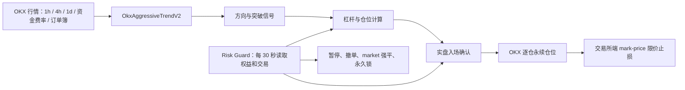

# OKX Aggressive Trend V2 交易策略说明

> 文档版本：1.0<br>
> 策略类：`OkxAggressiveTrendV2`<br>
> 交易框架：Freqtrade 2026.6<br>
> 交易所：OKX<br>
> 当前环境：30 USDT 模拟盘<br>
> 状态快照时间：2026-07-21 10:27（Asia/Shanghai）

## 1. 文档用途

本文记录当前部署版本的真实交易逻辑、风险限制、测试证据和上线条件。参数以代码和云端运行状态为准，不沿用早期计划中已经被测试否决的 8% / 12% / 20% 常规风险设置。

这份文档适合以下用途：

- 检查策略是否按照设计运行；
- 分析一笔交易为什么入场、如何计算仓位、为什么退出；
- 排查风险守卫是否正确限制了新仓；
- 审核模拟盘是否达到实盘门槛；
- 在修改参数前确认哪些内容已经做过样本外和压力测试。

本文不包含 API Key、Secret Key、API Passphrase、FreqUI 密码或 Telegram Token。

## 2. 当前结论

`OkxAggressiveTrendV2` 是一套 BTC 永续合约中低频趋势突破策略。策略在 1 小时主周期执行，使用已经完成的 4 小时 K 线识别突破和管理趋势，并用日线过滤长期方向。

当前版本只执行 A 级信号：

| 项目 | 当前值 |
|---|---:|
| 交易对 | `BTC/USDT:USDT` |
| 持仓方向 | 做多、做空 |
| 保证金模式 | 逐仓 |
| 持仓模式 | 单向，最多 1 个仓位 |
| 主执行周期 | 1h |
| 趋势与通道周期 | 4h |
| 长期方向过滤 | 1d |
| 单笔计划风险 | 账户权益的 2% |
| 当前最高杠杆 | 5 倍 |
| 当前保证金上限 | 10 USDT |
| 现金保留额 | 至少 10 USDT |
| 补仓 | 禁止 |
| 马丁格尔 | 禁止 |
| 网格摊平 | 禁止 |
| 固定 ROI 止盈 | 不使用 |
| 实盘状态 | 未开启 |

代码保留 S、S+ 的风险档位和最高 10 倍的基础设施能力，但当前入场函数只生成 `long_a` 和 `short_a` 标签。因此，风险守卫即使进入第二或第三阶段，也不会让现有信号自动使用 7 倍或 10 倍。后续版本必须先实现新的 S / S+ 信号，再单独完成验证。

## 3. 当前云端运行状态

截至状态快照时间：

| 状态项 | 当前值 |
|---|---:|
| Freqtrade 容器 | `running / healthy` |
| Risk Guard 容器 | `running` |
| 机器人状态 | `RUNNING` |
| `dry_run` | `true` |
| 模拟权益 | 29.7 USDT |
| 历史最高权益 | 29.7 USDT |
| 当前回撤 | 0% |
| 已闭合模拟交易 | 0 |
| 连续亏损 | 0 |
| 风险守卫 API 失败次数 | 0 |
| 新开仓限制 | 未触发 |
| 当前阶段 | Stage 1 |
| 当前风险上限 | 2% |
| 当前杠杆上限 | 5 倍 |
| 当前保证金上限 | 10 USDT |

`validation_lock=false` 在这里表示模拟盘允许收集交易数据，不代表实盘已经批准。实盘还需要同时满足以下条件：

1. 配置中的 `dry_run=false`；
2. `RISK_GUARD_VALIDATION_APPROVED=true`；
3. `RISK_GUARD_LIVE_APPROVED=true`；
4. 人工重置 Stage 1 计数和 high-water mark；
5. 资金已经由资金账户转入交易账户。

缺少第二或第三项时，策略会拒绝实盘入场。

## 4. 系统组成



系统分为两个相互独立的进程：

- Freqtrade 负责行情计算、信号、下单、仓位和持仓退出；
- Risk Guard 每 30 秒读取账户权益、交易记录和机器人配置，持久化最高权益及熔断状态。

Risk Guard 的状态文件位于：

```text
/root/freqtrade/user_data/risk_guard/state.json
```

策略每轮读取该文件。文件缺失、JSON 无法解析，或 `updated_at` 超过 90 秒时，新开仓会被禁止。

## 5. 数据周期和指标

### 5.1 1 小时主周期

1 小时数据用于：

- 每根新 K 线触发一次策略计算；
- 读取 ATR(14) 和 NATR(14)，控制杠杆与仓位；
- 读取过去 24 小时成交量中位数；
- 合并最近一次有效资金费率；
- 检查行情是否仍然新鲜。

策略设置 `process_only_new_candles=True`，不会在同一根 1 小时 K 线内反复生成新信号。

### 5.2 4 小时趋势和通道

4 小时数据计算：

- ATR(14)；
- NATR(14)；
- ADX(14)；
- EMA30、EMA60；
- 最近 30 根 4 小时 K 线成交量中位数；
- 多组 Donchian 高低通道。

滚动通道全部使用 `.shift(1)`。当前 K 线不参与自身突破阈值的计算，避免未来数据泄漏和自我引用。

### 5.3 日线长期过滤

日线计算 EMA30 和 EMA60。它只负责确认较快切换的大方向，不直接决定止损距离或下单金额。

### 5.4 启动数据量

策略要求 `startup_candle_count=1250`。机器人启动后需要足够的历史 K 线，才能让日线 EMA60、4 小时通道和其他滚动指标稳定。

旧 EMA 组合曾测试 900、1000 和 1250 根启动数据；切换到 EMA30/EMA60 后必须重新执行递归分析。

## 6. 参数表

### 6.1 当前选定参数

| 参数 | 当前值 | 作用 |
|---|---:|---|
| `channel_scale` | 1.0 | 选择长短通道周期 |
| `adx_offset` | 0 | 调整多空 ADX 门槛 |
| `atr_multiplier` | 2.0 | 初始价格止损的 ATR 倍数 |
| `trail_atr_multiplier` | 3.5 | Chandelier 跟踪止损距离 |

### 6.2 被测试的离散空间

| 参数 | 候选值 |
|---|---|
| `channel_scale` | 0.8、1.0、1.2 |
| `adx_offset` | -3、0、3 |
| `atr_multiplier` | 1.8、2.0、2.2 |
| `trail_atr_multiplier` | 2.5、3.0、3.5 |

理论组合数为 `3^4 = 81`。Freqtrade 实际保存了 65 个不重复组合，其余 epoch 因参数重复被跳过。

收益最高的单点使用 `ATR=1.8` 和 `trail ATR=3.5`。生产版本选择 `ATR=2.0`，因为相邻参数的结果接近，且较宽初始止损能减少把正常波动误判成趋势失效的概率。

### 6.3 通道周期映射

| `channel_scale` | 多头入场 / 退出 | 空头入场 / 退出 |
|---:|---:|---:|
| 0.8 | 24 / 12 根 4h | 64 / 32 根 4h |
| 1.0 | 30 / 15 根 4h | 80 / 40 根 4h |
| 1.2 | 36 / 18 根 4h | 96 / 48 根 4h |

当前值 1.0 对应：

- 多头突破过去 30 根已完成 4 小时 K 线的最高价；
- 多头退出参考过去 15 根 4 小时 K 线的最低价；
- 空头突破过去 80 根已完成 4 小时 K 线的最低价；
- 空头退出参考过去 40 根 4 小时 K 线的最高价。

多头和空头周期有意设置为不对称。BTC 长期存在正向漂移，多头需要较快参与趋势；空头用更长通道，减少在普通回调中反复做空。

## 7. 多头入场规则

多头候选信号 `long_a` 需要同时满足：

1. 4 小时收盘价突破过去 30 根已完成 4 小时 K 线的最高价；
2. 4 小时 EMA30 高于 EMA60；
3. 4 小时收盘价高于 EMA60；
4. 日线 EMA30 高于日线 EMA60；
5. 日线收盘价高于日线 EMA60；
6. 4 小时 ADX 不低于 18；
7. 4 小时成交量不低于过去 30 根 4 小时成交量中位数；
8. 1 小时成交量大于 0。

候选信号还要通过第一层质量确认：

```text
ADX >= 23
4h 成交量 >= 4h 成交量中位数 × 1.25
```

过强信号会被排除：

```text
ADX >= 28
4h 成交量 >= 4h 成交量中位数 × 1.50
```

可执行多头条件写成：

```text
executable_long = long_s AND NOT long_strong
```

排除极端 ADX 和极端放量的原因来自历史分层结果。这类突破经常出现在行情加速末端，25 笔极端动量交易的 Profit Factor 只有约 0.57；中等强度的多头突破表现更稳定。

最终标签为 `long_a`，使用 A 级风险。

## 8. 空头入场规则

空头候选信号 `short_a` 需要同时满足：

1. 4 小时收盘价跌破过去 80 根已完成 4 小时 K 线的最低价；
2. 4 小时 EMA30 低于 EMA60；
3. 4 小时收盘价低于 EMA60；
4. 日线 EMA30 低于日线 EMA60；
5. 日线收盘价低于日线 EMA60；
6. 4 小时 ADX 不低于 25；
7. 4 小时成交量不低于过去 30 根 4 小时成交量中位数；
8. 1 小时成交量大于 0。

以下强空头组合会被排除：

```text
ADX >= 30
4h 成交量 >= 4h 成交量中位数 × 1.25
```

可执行空头条件为：

```text
executable_short = short_a AND NOT short_s
```

极端放量下跌容易对应集中止损或恐慌抛售。此时追空离均值较远，止损后反弹风险上升。最终标签为 `short_a`，同样使用 A 级风险。

历史正式回测中的空头样本只有 5 笔，并且集中在 2022 年。空头分支目前可以在模拟盘运行，但其统计证据弱于多头分支。

## 9. 实际入场前的执行检查

K 线信号成立后，订单还要通过以下检查。

### 9.1 风险状态

- `entries_blocked` 必须为 `false`；
- Risk Guard 状态文件必须存在且可解析；
- 状态更新时间不得超过 90 秒；
- 当前信号等级不得超过守卫允许等级。

### 9.2 行情时效

最后一根已分析 K 线与当前时间的差值不得超过 2 小时 5 分钟。数据中断或机器人恢复后拿到旧行情时，策略不会追单。

### 9.3 订单簿价差

策略读取一档买卖价：

```text
mid = (best_ask + best_bid) / 2
spread = (best_ask - best_bid) / mid
```

`spread > 0.10%` 时拒绝入场。订单簿缺失或格式异常也会拒绝入场。

### 9.4 资金费率

资金费率只作为模拟盘和实盘的下单检查，不参与 2021 至 2025 年历史信号排名。

| 方向 | 允许范围 |
|---|---:|
| 做多 | `funding_rate <= +0.05%` |
| 做空 | `funding_rate >= -0.05%` |

资金费率未知时拒绝入场。历史回测跳过这一项，因为 OKX 公共接口只提供较短的近期资金费率历史。

### 9.5 实盘批准变量

当 `dry_run=false` 时，`RISK_GUARD_LIVE_APPROVED` 必须显式设置为真。缺少该变量时，策略记录错误并返回 `False`。

## 10. 动态杠杆

最终杠杆取以下四项的最小值：

```text
信号等级上限
波动率上限
Risk Guard 阶段上限
OKX 返回的最大允许杠杆
```

基础信号等级上限继承自 V1：

| 等级 | 上限 |
|---|---:|
| A | 5 倍 |
| S | 7 倍 |
| S+ | 10 倍 |

当前只生成 A 级信号，因此当前策略上限为 5 倍。

1 小时 NATR 的杠杆映射为：

| NATR | 波动率杠杆上限 |
|---:|---:|
| `<= 0.8%` | 10 倍 |
| `0.8% < NATR <= 1.5%` | 7 倍 |
| `1.5% < NATR <= 2.2%` | 5 倍 |
| `2.2% < NATR <= 3.0%` | 3 倍 |
| `> 3.0%` | 返回 1 倍 |

当前实现对 `NATR > 3%` 的处理是降到 1 倍，仍可能交易。它没有直接取消信号。后续若要恢复“高于 3% 完全不交易”的规则，需要修改入场或仓位回调并重新测试。

任何杠杆计算异常都会退回 1 倍。

## 11. 初始止损与仓位公式

### 11.1 初始价格止损

止损距离使用 4 小时 ATR：

```text
原始止损比例 = 4h ATR(14) × 2.0 / 入场价
最终止损比例 = clip(原始止损比例, 2.5%, 8.0%)
```

止损比例在开仓后写入交易自定义数据，后续不会因为 ATR 下降而扩大原始风险。

### 11.2 风险预算

```text
风险预算 = 当前账户权益 × min(信号风险比例, Risk Guard 风险上限)
```

当前 Stage 1 和 A 级信号均为 2%。若权益为 30 USDT：

```text
风险预算 = 30 × 2% = 0.60 USDT
```

### 11.3 保证金计算

```text
理论保证金 = 风险预算 / (价格止损比例 × 杠杆)

最终保证金 = min(
    理论保证金,
    Risk Guard 保证金上限,
    Freqtrade 允许的 max_stake,
    当前权益 - 10 USDT
)
```

例：权益 30 USDT，止损 4%，杠杆 5 倍：

```text
风险预算 = 30 × 2% = 0.60 USDT
理论保证金 = 0.60 / (4% × 5) = 3.00 USDT
名义仓位 = 3.00 × 5 = 15.00 USDT
```

价格从入场点逆向运行 4% 时，预期方向性损失约为 0.60 USDT，未计入跳空、手续费和止损限价未成交风险。

若计算结果低于 OKX / CCXT 返回的最小下单额，信号会被跳过。

### 11.4 现金保留

策略始终尝试保留至少 10 USDT：

```text
reserve_cap = max(0, equity - 10)
```

30 USDT 账户最多有 20 USDT 可用于保证金，但当前 Stage 1 进一步限制为 10 USDT。随着权益下降，可用保证金会自动减少。

## 12. 订单类型

| 用途 | 类型 |
|---|---|
| 普通入场 | market |
| 普通退出 | market |
| 紧急退出 | market |
| 强制退出 | market |
| 交易所止损 | limit |
| 止损触发价格 | mark price |
| 止损刷新间隔 | 60 秒 |
| 止损限价比率 | 0.99 |

入场和退出使用订单簿另一侧价格。`order_book_top=1` 表示参考一档报价。

限价止损不能保证极端行情下按计划价格成交。跳空、流动性下降、交易所异常或价格快速穿透限价时，实际损失可能超过 2% 风险预算。Risk Guard 的 market 强制退出也无法消除交易所停机和网络中断风险。

## 13. 持仓退出规则

### 13.1 多头通道退出

满足任一条件时生成 `long_channel_exit`：

- 4 小时收盘价跌破过去 15 根已完成 4 小时 K 线的最低价；
- 4 小时 EMA30 低于 EMA60。

### 13.2 空头通道退出

满足任一条件时生成 `short_channel_exit`：

- 4 小时收盘价突破过去 40 根已完成 4 小时 K 线的最高价；
- 4 小时 EMA30 高于 EMA60。

### 13.3 1R 后保护成本

Freqtrade 的 `current_profit` 已包含杠杆影响。策略定义：

```text
初始 R = 初始价格止损比例 × 杠杆
```

浮盈达到 1R 后，止损移动到开仓价上方或下方的手续费缓冲位置：

```text
fee_buffer_profit = 0.0015 × 杠杆
```

该缓冲用于覆盖常见往返手续费和少量滑点，不保证每次都能实现净保本。

### 13.4 2R 后跟踪止损

浮盈达到 2R 后启用 Chandelier 跟踪止损：

```text
多头止损 = 持仓后的最高价 - 4h ATR × 3.5
空头止损 = 持仓后的最低价 + 4h ATR × 3.5
```

策略不设置固定 ROI 止盈。趋势持续时，仓位可继续持有，直至通道、均线或跟踪止损触发。

### 13.5 96 小时时间退出

持仓满 96 小时后，若持仓期间的最大浮盈仍低于 0.5R，返回 `time_stop_96h` 并退出。

若曾经达到 0.5R，即使当前利润回落，也不会由时间规则强制退出，后续交给通道和止损处理。

## 14. Freqtrade 内置保护

启用保护参数回测或实盘运行时，策略包含：

### 14.1 CooldownPeriod

每次平仓后等待 3 根 1 小时 K 线，期间不重新入场。

### 14.2 StoplossGuard

在过去 24 根 1 小时 K 线内出现 2 笔不盈利退出后，暂停 12 根 1 小时 K 线。该保护不区分交易方向，也不只限于单个交易对。

Risk Guard 还会独立统计连续亏损，两套保护可以同时生效。

## 15. 账户级 Risk Guard

### 15.1 阶段限制

| 阶段 | 最大信号等级 | 风险上限 | 杠杆上限 | 保证金上限 |
|---:|---:|---:|---:|---:|
| Stage 1 | A | 2% | 5 倍 | 10 USDT |
| Stage 2 | S | 3.5% | 7 倍 | 15 USDT |
| Stage 3 | S+ | 5% | 10 倍 | 20 USDT |

这些是守卫允许上限。最终值仍会与策略信号等级上限取较小值。当前只有 A 级标签，实际风险不会因为阶段自动提升到 3.5% 或 5%。

### 15.2 自动阶段条件

Stage 1 升到 Stage 2：

- `RISK_GUARD_AUTO_PROMOTE=true`；
- 从最近一次人工 reset 后累计至少 10 笔闭合交易；
- high-water 回撤低于 20%；
- 当前不在恢复模式。

Stage 2 升到 Stage 3：

- 累计至少 20 笔闭合交易；
- Freqtrade 报告的 Profit Factor 不低于 1.15；
- `RISK_GUARD_SPLUS_APPROVED=true`；
- high-water 回撤低于 20%；
- 当前不在恢复模式。

当前应保持 `RISK_GUARD_SPLUS_APPROVED=false`。

### 15.3 连续亏损

| 条件 | 处理 |
|---|---|
| 连续 2 笔亏损 | Stage 1 风险上限从 2% 降到 1% |
| 连续 3 笔亏损 | 禁止新开仓、撤销未完成订单、market 平仓、暂停 24 小时 |

暂停结束后，Risk Guard 调用 `start` 恢复机器人，并继续使用当时的风险限制。

### 15.4 日内回撤

每个 UTC 日记录日初权益。日内回撤达到 20% 时：

- 禁止新开仓；
- 撤销未完成订单；
- market 平掉全部持仓；
- 暂停到下一个 UTC 日。

### 15.5 周回撤

每个 ISO 周记录周初权益。周回撤达到 35% 时，执行强制退出并暂停 7 天。

### 15.6 high-water 回撤

| 从历史最高权益回撤 | 处理 |
|---:|---|
| 20% | 退回 Stage 1，风险 1%，最高 3 倍，保证金 5 USDT |
| 35% | 进入恢复模式并强制暂停；若周回撤也达到 35%，优先暂停 7 天，否则暂停 72 小时 |
| 50% | 永久锁定 |

35% 回撤后的恢复模式保持：

```text
最大信号等级 = A
风险上限 = 1%
杠杆上限 = 3 倍
保证金上限 = 5 USDT
```

权益回到 high-water 回撤 20% 以内后，恢复模式解除并回到 Stage 1。

### 15.7 50% 永久锁

触发后，Risk Guard 会：

1. 先把永久锁写入磁盘；
2. 调用 `stopentry`；
3. 撤销检测到的未完成订单；
4. 调用 `forceexit`，以 market 退出全部持仓；
5. 给 `BTC/USDT:USDT` 创建到 2099 年的 pair lock；
6. 等待人工检查和 reset。

持久化动作先于 RPC 平仓。即使平仓调用失败，策略也会先看到 `entries_blocked=true`，避免继续开仓。

### 15.8 Risk Guard API 故障

每次读取 Freqtrade API 失败时：

- `api_failures` 加 1；
- 立即写入 `entries_blocked=true`；
- 原因记录为 `risk_guard_api_failure`；
- 连续 3 次失败时发送告警。

## 16. 策略明确禁止的行为

- 同时持有多个交易对；
- 同时持有多个 BTC 仓位；
- 亏损补仓；
- 调整仓位摊低成本；
- 马丁格尔加码；
- 网格交易；
- 强制手工开仓；
- 仅因上一次亏损而提高下一笔风险；
- 用 10 倍作为默认杠杆；
- 用固定 ROI 过早截断长趋势。

配置中 `force_entry_enable=false`，策略中 `position_adjustment_enable=False`。

## 17. 从 V1 到 V2 的主要变化

V1 的首次完整冒烟回测结果为：

| 指标 | V1 |
|---|---:|
| 交易数 | 118 |
| Profit Factor | 0.44 |
| Sharpe | -0.26 |
| 最大回撤 | 66.63% |

V1 的主要问题：

- 1 小时突破交易过于频繁，手续费和假突破损失较高；
- 118 笔交易几乎全部集中在 2021 至 2022 年；
- 账户权益跌到 10 USDT 保留线后不再下单，后续年份没有得到真实评估；
- 原始 A / S / S+ 分级与实际盈利能力不一致；
- “更高 ADX 和更高成交量代表更强信号”的假设没有得到数据支持。

V2 保留 V1 中已测试的运行时安全代码，包括风险状态读取、价差检查、行情延迟检查、动态杠杆、交易所止损和时间退出。信号层改为完成 4 小时 K 线的非对称通道，并排除极端动量追涨追跌。

## 18. 回测和验证证据

> 本节数字来自更换 EMA30/EMA60 之前的信号版本，只能作为旧版基线。当前版本必须完成第 23 节的全套验证后才能用于实盘审批。

### 18.1 最终合并压力回测

区间：2021-02-22 至 2026-07-19。<br>
钱包：30 USDT。<br>
费用：单边 0.10%。<br>
盘中细节：15m。<br>
保护机制：启用。

| 指标 | 结果 |
|---|---:|
| 闭合交易 | 35 |
| 盈利 / 亏损 | 22 / 13 |
| 胜率 | 62.9% |
| 绝对利润 | 22.214 USDT |
| 总收益 | 74.05% |
| 最终余额 | 52.214 USDT |
| 平均单笔利润 | 16.65% |
| Profit Factor | 3.30 |
| 日权益 Sharpe | 0.93 |
| 最大回撤 | 5.89% |
| 平均持仓时间 | 4 天 8 小时 56 分钟 |

单边 0.10% 费用高于很多正常成交场景，用作手续费与滑点压力测试。

### 18.2 2026 未触碰样本

参数冻结后，2026 年数据只运行了一次：

| 指标 | 结果 |
|---|---:|
| 交易数 | 2 |
| 绝对利润 | 2.269 USDT |
| 收益 | 7.56% |
| Profit Factor | 4.29 |
| 日权益 Sharpe | 1.05 |
| 最大回撤 | 2.09% |

只有 2 笔交易，结果只能说明 holdout 没有否决策略，无法单独证明未来盈利能力。

### 18.3 半年测试窗口

| 窗口 | 交易数 | 利润 | Profit Factor | 最大回撤 |
|---|---:|---:|---:|---:|
| 2023 H2 | 4 | +0.538 USDT | 1.31 | 5.77% |
| 2024 H1 | 4 | +2.421 USDT | 2.97 | 3.65% |
| 2024 H2 | 3 | +4.343 USDT | 无亏损交易 | 0% |
| 2025 H1 | 3 | +0.340 USDT | 2.05 | 1.08% |
| 2025 H2 | 6 | -0.830 USDT | 0.32 | 2.99% |

五个窗口中四个盈利。每个窗口的交易数仍然较少。

### 18.4 Lookahead Analysis

| 检查项 | 结果 |
|---|---:|
| 捕获信号 | 20 |
| 入场偏差 | 0 |
| 退出偏差 | 0 |
| 结论 | 未检测到未来数据泄漏 |

### 18.5 Recursive Analysis

EMA30/EMA60 替代旧的 EMA20/50/100/200 后，原递归分析结果不再适用。部署前必须重新运行 900、1000、1250 根启动 K 线的递归分析，并记录 EMA30、EMA60 和交易结果的最大差异。

### 18.6 参数稳定性

表现靠前的组合覆盖：

- 通道尺度 0.8、1.0、1.2；
- ATR 止损 1.8、2.0、2.2；
- 跟踪 ATR 3.0、3.5。

当前参数位于盈利区域中间，没有采用唯一的收益尖峰。

### 18.7 Monte Carlo

使用最终 35 笔交易重建权益收益率，做 20,000 次 bootstrap：

| 指标 | 35 笔 horizon | 100 笔 horizon |
|---|---:|---:|
| 95% 分位最大回撤 | 12.88% | 16.09% |
| 99% 分位最大回撤 | 16.52% | 19.95% |
| 触及 15 USDT 概率 | 0% | 0% |
| 5% 分位期末权益 | 35.48 USDT | 75.76 USDT |

bootstrap 假设未来交易分布可以由现有 35 笔近似。样本少、市场状态会变化，0% 只表示 20,000 条模拟路径中没有出现，不代表真实概率严格等于零。

### 18.8 Deflated Sharpe

考虑 65 个不重复参数试验后：

| 指标 | 结果 |
|---|---:|
| 日收益观察数 | 1777 |
| 年化 Sharpe（365 日） | 0.978 |
| Deflated Sharpe 概率 | 83.45% |
| 日收益偏度 | 14.76 |
| 日收益峰度 | 262.73 |

83.45% 是正面证据，但达不到很强的统计置信度。收益由少数大趋势贡献，日收益分布具有高偏度和高峰度，因此当前只允许小额模拟和 A 级风险。

## 19. 已知限制

### 19.1 样本量

最终正式样本只有 35 笔；2026 holdout 只有 2 笔；空头只有 5 笔。任何胜率、Profit Factor 和 Sharpe 都有较宽的统计误差。

### 19.2 资金费率历史不完整

OKX 公共接口未提供完整的 2021 至今资金费率。历史回测把资金费率当作未知并跳过实时 veto，未精确扣除每次持仓的真实资金费成本。

### 19.3 止损成交风险

交易所止损使用 limit。快速跳空时可能无法立即成交。账户风险预算是计划值，无法保证实际最大亏损严格不超过 2%。

### 19.4 单一资产

策略只测试 BTC 永续，不应直接复制到 ETH、SOL 或其他合约。不同币种的波动结构、最小合约和资金费率行为不同。

### 19.5 市场状态变化

策略依赖趋势延续。长期震荡、假突破增多或交易结构变化时，历史参数可能失效。

### 19.6 S / S+ 尚未实现为可执行标签

Risk Guard 有第二和第三阶段，策略当前只生成 A 标签。解锁高阶段不会提高现有交易的信号等级。开放 7 倍或 10 倍前需要修改代码并重新执行完整验证。

### 19.7 Telegram 尚未启用

配置中的 Telegram 当前为关闭状态。开平仓、风险触发和系统异常只能通过日志和 FreqUI 检查，直到提供 Bot Token 和 Chat ID。

## 20. 模拟盘验收规则

模拟盘开始时间约为 2026-07-21 03:44（Asia/Shanghai）。

第一轮检查时间不得早于 2026-08-04 03:44，并同时满足：

- 连续运行至少 14 天；
- 至少 10 笔闭合交易；
- 没有下单、止损、数据、API 或状态持久化异常；
- 实时 Profit Factor 为正，目标不低于 1.15；
- 最大回撤低于 20%；
- 没有触发永久锁；
- 实际仓位风险与计算值基本一致；
- 交易所止损在每笔成交后正确存在。

14 天后不足 10 笔时，模拟盘延长到 30 天。低频策略不能为了凑交易数缩短通道或降低 ADX 门槛。

模拟盘通过后也只具备进入“小额实盘 Stage 1 审批”的资格，不自动切换实盘。

## 21. 实盘审批步骤

实盘切换应安排维护窗口，并按以下顺序执行：

1. 导出模拟盘交易记录、日志和 Risk Guard 状态；
2. 确认没有开放模拟仓位和未完成订单；
3. 检查最近版本仍通过单元测试和策略加载；
4. 备份 `/root/freqtrade`；
5. 把 30 USDT 从资金账户转入交易账户；
6. 保持 Stage 1，风险 2%、最高 5 倍、保证金 10 USDT；
7. 把 `dry_run` 改为 `false`；
8. 明确设置 `RISK_GUARD_VALIDATION_APPROVED=true`；
9. 明确设置 `RISK_GUARD_LIVE_APPROVED=true`；
10. reset Stage 1 和 high-water mark；
11. 重启并检查交易所账户模式、逐仓设置、资金费率和订单簿；
12. 第一笔实盘成交后人工核对杠杆、保证金、止损和预计最大损失。

在完成第 8 和第 9 项前，不应修改为实盘。

## 22. 日常运维检查

### 22.1 容器状态

```bash
cd /root/freqtrade
docker compose ps
```

预期：

- `freqtrade` 为 `running / healthy`；
- `risk-guard` 为 `running`；
- 端口只显示 `127.0.0.1:8081->8080/tcp`。

### 22.2 Risk Guard 状态

```bash
jq '{
  simulation_mode,
  validation_lock,
  entries_blocked,
  deployment_stage,
  risk_cap,
  leverage_cap,
  margin_cap,
  equity,
  high_water,
  drawdown,
  daily_drawdown,
  weekly_drawdown,
  consecutive_losses,
  closed_trade_count,
  profit_factor,
  api_failures,
  updated_at
}' /root/freqtrade/user_data/risk_guard/state.json
```

### 22.3 机器人心跳

```bash
tail -100 /root/freqtrade/user_data/logs/freqtrade.log \
  | grep 'Bot heartbeat' \
  | tail -1
```

### 22.4 最近错误

```bash
cd /root/freqtrade
docker compose logs --since 24h freqtrade risk-guard \
  | grep -E 'ERROR|CRITICAL|Traceback'
```

### 22.5 备份

当前 V2 上线前备份：

```text
/root/freqtrade-backups/aggressive-20260720T194407Z
```

回滚前要确认没有开放仓位。不要在持仓中直接替换策略代码或交易数据库。

## 23. 修改策略后的强制验证

以下改动都视为新策略版本：

- 修改入场或退出条件；
- 修改通道周期；
- 修改 ADX 或成交量门槛；
- 修改止损或跟踪 ATR；
- 修改风险比例、杠杆、保证金或现金保留额；
- 增加交易对；
- 开放 S / S+；
- 把 `NATR > 3%` 从 1 倍改成禁止交易；
- 更换 Freqtrade、CCXT 或 Docker 镜像大版本。

新版本至少要重新执行：

1. 风险守卫单元测试；
2. 策略加载检查；
3. 2021 至最近完整年份压力回测；
4. 15m detail 回测；
5. 半年窗口测试；
6. 参数上下扰动；
7. Lookahead Analysis；
8. Recursive Analysis；
9. Monte Carlo；
10. 新的未触碰样本或重新开始模拟盘。

已经看过的数据不能再次被称为未触碰样本。

## 24. 相关文件

| 文件 | 用途 |
|---|---|
| `runtime/strategies/OkxAggressiveTrendV2.py` | V2 信号、仓位、止损和实盘入场检查 |
| `runtime/strategies/OkxAggressiveTrendV1.py` | V2 继承的运行时保护和通用回调 |
| `runtime/risk_guard.py` | 账户级回撤、阶段、暂停和永久锁 |
| `runtime/config.json` | Freqtrade 交易与订单配置 |
| `docker-compose.yml` | 云端容器、端口和健康检查 |
| `tests/test_risk_guard.py` | Risk Guard 单元测试 |
| `tools/validate_backtest.py` | Monte Carlo 和 Deflated Sharpe 计算 |
| `.env.example` | 环境变量模板，不含真实密钥 |

## 25. 当前发布决定

当前版本允许继续运行 30 USDT 模拟盘，实际限制为 A 级 2% 风险、最高 5 倍、保证金不超过 10 USDT。

当前版本不批准：

- 真实资金自动交易；
- S / S+ 风险；
- 7 倍或 10 倍自动杠杆；
- 15 USDT 或 20 USDT 自动保证金；
- 增加其他币种；
- 因短期模拟结果调整参数。

下一次正式决策点是模拟盘满 14 天且至少完成 10 笔闭合交易之后。样本不足时延长到 30 天。
